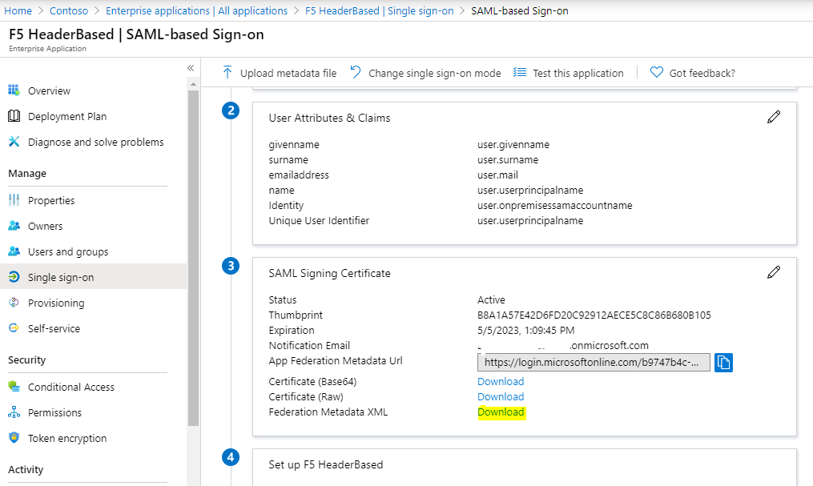
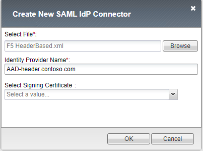
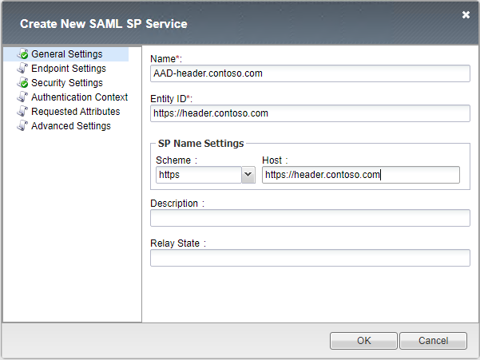
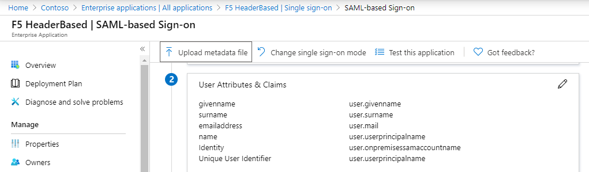

# Introduction

In this tutorial, you'll learn how to integrate F5 with Azure Active Directory (Azure AD)

When you integrate F5 with Azure AD, you can:

- Control in Azure AD who has access to the F5 published website.
- Enable your users to be automatically signed-in to F5 with their Azure AD accounts (SSO).
- Manage your accounts in one central location - the Azure portal.

To learn more about SaaS app integration with single sign-on in Azure AD, see Single sign-on to applications in Azure Active Directory.

This chapter describes the initial SAML configuration between F5 and Azure AD. In the next chapters, this configuration will be used in an Access Profile. Note that for each application you wish to publish through F5 with Azure AD sign-in support, you will have to create a new IdP and SP in F5.

## Prerequisites

To get started, you need the following items:

- An Azure AD subscription. If you don't have a subscription, you can get a free account.

Deploying the joint solution requires the following license:

- F5 BIG-IP® Best bundle (or)
- F5 BIG-IP Access Policy Manager™ (APM) standalone license
- F5 BIG-IP Access Policy Manager™ (APM) add-on license on an existing BIG-IP F5 BIG-IP® Local Traffic Manager™ (LTM).

In addition to the above license, the F5 system may also be licensed with:

- A URL Filtering subscription to use the URL category database
- An F5 IP Intelligence subscription to detect and block known attackers and malicious traffic
- A network hardware security module (HSM) to safeguard and manage digital keys for strong authentication

> [!NOTE]
> This walkthrough uses sample names and values from a company called Contoso. Replace these with your own. For example:
>
> - Domain name - **Contoso**
> - Application Name - **Header App**
> - Application URL - **https://header.contoso.com**

## Creating an application in AAD

The (web) application hosted by F5 will require an "Enterprise Application" in Azure AD. This Enterprise Application will control who has (initial) access and establish the SSO functionality to F5.

1. Open Azure Active Directory in Azure and select **Enterprise Applications**
1. Click **+ New Application** and then under **Add from the Gallery** type **F5**
1. Give the application a new name such as `<Header App>` and click **Add**
1. Once the application details open, select **Single sign-on** and select **SAML**
1. In the pop-up select **No, I'll save later**
1. Under the SAML Signing Certificate download the **Federation Metadata XML** file and save it.

## Creating an IDP and SP in F5

This chapter will create an IDP linked to the created Azure AD application.

1. In F5 select **Access >> Federation : SAML Service Provider : External IdP Connectors**
1. Click the down arrow under **Create** and select **From metadata**
1. Browse for the AAD downloaded `<Federation Metadata XML>` file, give the provider a name such as `<AAD-header.contoso.com>` and click **OK**

4. Go to **Access >> Federation : SAML Service Provider : Local SP Services** and click **Create**
1. Give a **Name** (such as `<AAD-header.contoso.com>`) an **Entity ID** (such as `<https://header.contoso.com>`) and **Host** (such as `<https://header.contoso.com>`) and click **OK**
1. Select the newly created Service Provider entry and click **Bind/Unbind IdP Connectors**
1. in the pop-up, select **Add New Row**. Select the created IdP provider (`<AAD-header.contoso.com>`) in the dropdown under **SAML IdP Connectors** and click **Update** and click **OK** to close
1. Select the newly created Service Provider entry and click **Export Metadata**

A file will be downloaded from the F5 device. This file will have to be uploaded into the application in Azure under the SAML configuration.

1. Open Azure Active Directory in Azure and select **Enterprise Applications**
1. search for your created application (`<Header App>`) and open the properties of the application
1. Once the application details are open, select **Single sign-on** and select **SAML**
1. on the top bar, select **Upload metadata file** and upload the exported F5 XML file.
1. click **Save**

## Next steps

This concludes the configuration of the SP, IdP and Azure AD configuration which is required for almost all F5 scenario's such as Kerberos, Header based and advanced Header injection scenarios.

- [F5 - Azure AD Integration - Access Profile](f5-accessprofile.md) - creating an access profile using the SAML IdP provider

> Other items in this tutorial
> 
> - [Publishing Kerberos based applications with AAD & F5](f5-kerberos.md)
> - [Publishing Header based applications with AAD & F5](f5-header-based.md)
> - [Publishing Advanced Header based applications with AAD & F5](f5-advanced-header.md) - an advanced scenario where an external LDAP store is used to inject HTTP HEADERS to the backend webserver.
