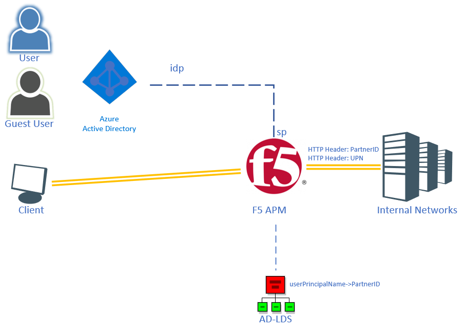
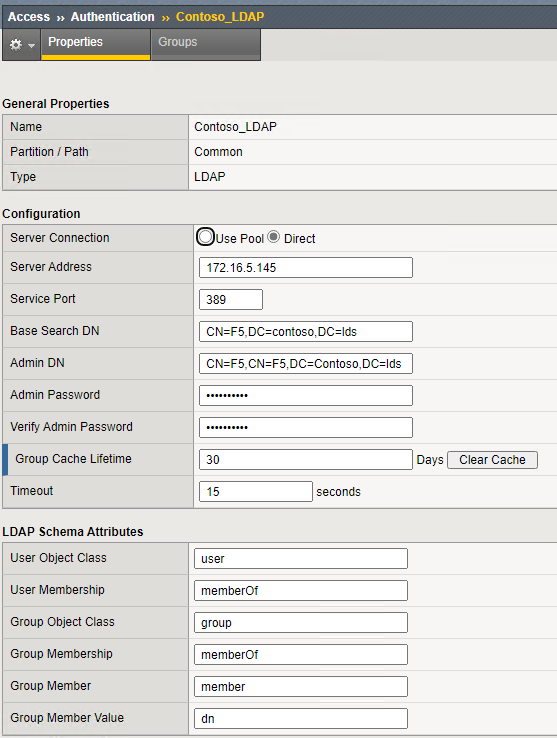
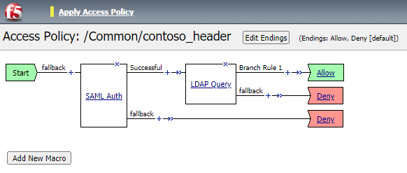

# F5 - Azure AD Integration - Access Profile

## Introduction

In this scenario an external LDAP store is used to retrieve additional attributes for the logged in user and send these headers to the backend web application.
This example uses an external Active Directory Lightweight Directory Service (AD-LDS) to provide an attribute called "ParterID" and searches are performed based on the incoming SAML attribute userPrincipalName stored in the session.saml.last.identity variable in F5 upon successful SAML authentication.



> [!NOTE]
> This walkthrough uses sample names and values from a company called Contoso. Replace these with your own. For example:
>
> - LDAP server name - **CONTOSO LDAP**
> - LDAP Base DN - **CN=F5,DC=CONTOSO,DC=lds**
> - LDAP username - **F5**
> - LDAP port - **389**
> - LDAP Attribute - **PartnerID**
> - Application Name - **Header App**
> - Application URL - **https://header.contoso.com**
> - SSL Client Profile - **Contoso_SSL**
> - iRule Name - **PartnerID_HeaderInjection**

## Creating the LDAP connection

For F5 to be able to query our LDAP store it needs to have a connection to the LDAP server with a username and password. For this;

1. In the F5 admin console, go to **Access >> Authentication : LDAP** and click **Create...**
1. Provide a name for the LDAP server entry in F5 `<Contoso LDAP>` and configure the server connection (either Direct or Pool)
1. In this scenario we will use Direct and put the IP address of the LDAP server
1. Set the service port to the `<LDAP port>` and set the `<Base DN>`
1. Provide the LDAP username and its password and click **Finish**



## Adding LDAP query to Access Profile
One the LDAP server is configured it can be added to the Access Profile to retrieve additional information for the logged-in user.
1. Go to **Access >> Profiles / Policies : Access Profiles (Per-Session Policies)** and click the earlier created (`<Header App>`) access profile
1. Click **Edit** under the Per-Session Policy column
1. A new window will open with the Access Policy showing `<start>` + `<SAML auth>` - Successful - `<Allow>` | - fallback - `<Deny>`
1. Click the **+** sign on the Successful leg. A pop-up will be shown
1. In the pop-up, select the **Authentication** tab and there select **LDAP Query** and click **Add Item**
1. A new pop-up will be shown for the LDAP Query configuration. In the **Server** dropdown list select the earlier created LDAP server (/Common/`<Contoso LDAP>`)
1. For the searchDN type the DN of where the LDAP objects are (`<CN=F5,DC=CONTOSO,DC=lds>`)
1. For the searchfilter type `<(userPrincipalName=%{session.saml.last.identity})>`
1. Click **Add new entry** and type the requested LDAP attribute(s) - (`<PartnerID>`)
1. Click the **Branch Rules** tab
1. Remove the default User Group Membership rule by clicking **(X)**
1. Click **Add Branch Rule** and under expression click **change**
1. In the pop-up, select **Add Expression** and set
- Agent Sel: **LDAP Query**
- Condition: **LDAP Query Passed**
- LDAP Query has: **Passed**
1. Click **Add Expression** and click **Finished**
1. click **Save**



[optionally]
As the SAML auth as well as the LDAP auth fallback results in a deny, you might want to add an alert for the user if the LDAP lookup itself fails. That way, the user can call the helpdesk if access is denied with a more specific error.

1. Click **+** in the LDAP fallback branch
1. In the pop-up select the **General Purpose** tab
1. Select the **Message Box** and click **Add Item**
1. In the pop-up under the message text file, type a meaningful error message ("Your Partner ID was not found")
1. click **Save**

## Adding iRule
Headers need to be added through an iRule. iRules are executed on the connection and provide advanced capabilities for session management. In our case we want to add the PartnerID as an HTTP Header to the backend server.

1. Go to **Local Traffic >> iRules : iRule List** and click **Create**
1. Provide a name for the iRule (`<PartnerID_HeaderInjection>`)
1. In the **Definition** paste the following code:

```iRule
when RULE_INIT {
    set static::debug 0
}
when ACCESS_ACL_ALLOWED {
set PARTNERID [ACCESS::session data get "session.ldap.last.attr.PartnerID"]
if { $static::debug } { log local0. "PARTNERID = $PARTNERID" }
if { !([HTTP::header exists "PARTNERID"]) } {
    HTTP::header insert "PARTNERID" $PARTNERID
    }else{
    HTTP::header replace "PARTNERID" $PARTNERID
    }
}
```

The code itself does the following;
When the rule is activated, it will only start when Access is allowed (Allow from the Access Rule) - it will then fill a variable `<PARTNERID.` with the session variable session.`<ldap.last.attr.PartnerID>` which is retrieved through the LDAP Query. Then it will inject the PartnerID as a Header to the backend webserver. If an existing Header is present, it will be replaced by the `<PARTNERID.` from the LDAP Query (to prevent someone injecting their own).

1. Click **Finish**

## Creating a Virtual Server entry

Now that the initial configuration is complete we can publish a backend webserver. This will combine the created Access Policy and iRule. The Access Policy will provide the authentication and LDAP Query and the iRule will be injecting the retrieved LDAP attribute into an HTTP Header.

First we will need to create a backend pool. An object containing the servers / ports for the backend web application.

1. Go to **Local Traffic ›› Pools : Pool List** and click **Create...**
1. Give a name for the new pool (`<Header_App_Pool>`)
1. Set a health monitor by adding http to the Active selection under Monitoring by clicking http and then **<<**
1. Under Resources \ New Members \ Address type the FQDN or IP address of the backend webserver
1. Under service port set the port (`<80>`) and the service type to HTTP and click **Add**
1. Click **Finished**

To publish the backend webserver

1. Go to **Local Traffic ›› Virtual Servers : Virtual Server List** and click **Create...**
1. Provide a name for the virtual server (`<Header_App>`) and provide a destination address / mask. This will be the IP address F5 will be listening on.
1. Set the service port to **443** and the service to **HTTPS**
1. Under configuration for the**HTTP profile** set it to **http**
1. Under Configuration for the SSL Profile Client, add your SSL Client profile created earlier `<Contso_SSL>`
1. Under Access Policy for the Access Profile, set the value to the earlier created Access Profile `<Header App>`
1. Under the Resources option, add the earlier created iRule `<PartnerID_HeaderInjection>`
1. Under the Resources option set the pool to the earlier created pool (`<Header_App_Pool>`).
1. Click **Finished**

The Virtual Server should have a green indicator in front of the name ensuring the backend webserver is available. This concludes the configuration.

## Testing

> [!NOTE]
Prior to users being able to connect to the website, the FQDN of the website needs to be resolvable. While theoretically the certificate doesn't have to match the URL this is highly advised. Make sure your test client can find the IP address of the virtual server for the configured name for the website. This can be done through DNS or by manipulating the local hosts file on the test client.

In order to test the web publication, an user with the same userPrincipalName as our Azure AD user will have to be existent in the LDAP store and have its PartnerID provisioned. Once the user logs in to Azure AD (myapps.microsoft.com) they can click the (`<Header_App>`) in the portal. This will send them to the FQDN configured for the application. If all is well, F5 will authenticate the user using the SAML token and then perform the LDAP lookup prior to injecting the HTTP header and sending the user to the backend website.

